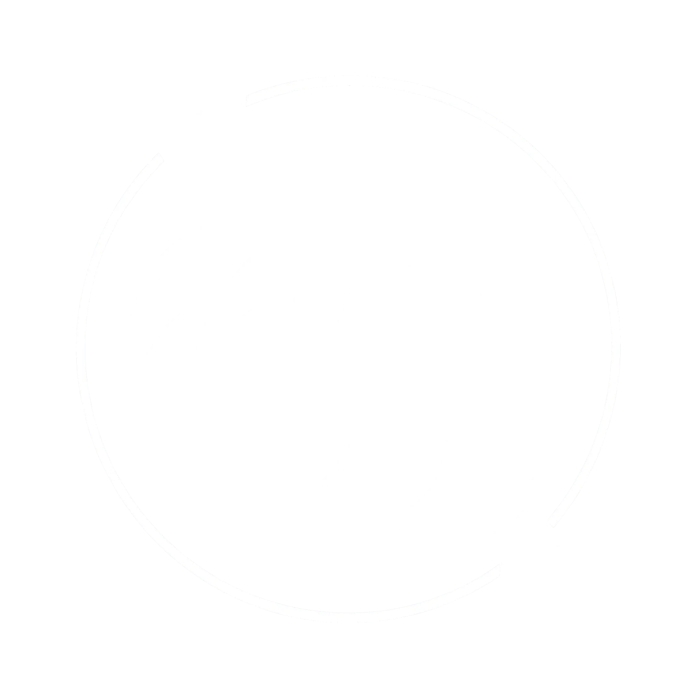

<a name="readme-top"></a>

[![Contributors][contributors-shield]][contributors-url]
[![Stargazers][stars-shield]][stars-url]
[![Issues][issues-shield]][issues-url]

<br />
<div align="center">
  <a href="https://github.com/silencelen/bybrynn-code">
    
  </a>

  <h3 align="center">Bybrynn-code</h3>

  <p align="center">
    The offical repo for the active html/css structure of bybrynn.com
    <br />
    <a href="https://github.com/silencelen/bybrynn-code"><strong>Explore the docs »</strong></a>
    <br />
    <br />
    <a href="https://bybrynn.com">View Website</a>
    ·
    <a href="https://github.com/silencelen/bybrynn-code/issues">Report Bug</a>
    ·
    <a href="https://github.com/silencelen/bybrynn-code/issues">Request Feature</a>
  </p>
</div>

## About The Project

Managing a website comes with its challenges, thats why we've institued the bybrynn.com public repo. In an attempt to streamline progress and collaboration, the complete source structure is online for review.

Community review and feedback is heavily encouraged.
<br/>
<br/><br/>

## Installation

How can I access the repo?

### Method 1: Universal

Clone the repo

```sh
git clone https://github.com/silencelen/bybrynn-code
```

### Method 2: use ./clone command on local server (admin access required)

issue clone script command

```sh
./clone
```

### Method 3: issue a direct transfer request

Email dev with the specified folder paths and depth.

```js
webmaster@silencelen.com
```

<br/>

## Roadmap

- [x] Add home page
- [x] Add about page
- [x] Add shop page
- [x] Add portfolio page
- [x] Add art page
- [x] Add single pages
- [x] Add photography page
- [ ] Add mobile specific version
- [ ] Multi-language Support
  - [ ] Chinese
  - [ ] Spanish

See the [open issues](https://github.com/silencelen/bybrynn-code/issues) for a full list of proposed features (and known issues).

## License

Distributed under no license, © 2023 - Brynn Monahan - All Rights Reserved.

## Contact

Webmaster - webmaster@bybrynn.com

Business inquiries: [@bybrynnm] - contact@bybrynn.com

[contributors-shield]: https://img.shields.io/github/contributors/silencelen/bybrynn-code.svg?style=for-the-badge
[contributors-url]: https://github.com/silencelen/bybrynn-code/graphs/contributors
[forks-shield]: https://img.shields.io/github/forks/silencelen/bybrynn-code.svg?style=for-the-badge
[forks-url]: https://github.com/silencelen/bybrynn-code/network/members
[stars-shield]: https://img.shields.io/github/stars/silencelen/bybrynn-code.svg?style=for-the-badge
[stars-url]: https://github.com/silencelen/bybrynn-code/stargazers
[issues-shield]: https://img.shields.io/github/issues/silencelen/bybrynn-code.svg?style=for-the-badge
[issues-url]: https://github.com/silencelen/bybrynn-code/issues
[license-shield]: https://img.shields.io/github/license/silencelen/bybrynn-code.svg?style=for-the-badge
[license-url]: https://github.com/silencelen/bybrynn-code/blob/main/LICENSE.txt
[linkedin-shield]: https://img.shields.io/badge/-LinkedIn-black.svg?style=for-the-badge&logo=linkedin&colorB=555
[linkedin-url]: https://linkedin.com/in/othneildrew
[product-screenshot]: images/screenshot.png
[Next.js]: https://img.shields.io/badge/next.js-000000?style=for-the-badge&logo=nextdotjs&logoColor=white
[Next-url]: https://nextjs.org/
[React.js]: https://img.shields.io/badge/React-20232A?style=for-the-badge&logo=react&logoColor=61DAFB
[React-url]: https://reactjs.org/
[Vue.js]: https://img.shields.io/badge/Vue.js-35495E?style=for-the-badge&logo=vuedotjs&logoColor=4FC08D
[Vue-url]: https://vuejs.org/
[Angular.io]: https://img.shields.io/badge/Angular-DD0031?style=for-the-badge&logo=angular&logoColor=white
[Angular-url]: https://angular.io/
[Svelte.dev]: https://img.shields.io/badge/Svelte-4A4A55?style=for-the-badge&logo=svelte&logoColor=FF3E00
[Svelte-url]: https://svelte.dev/
[Laravel.com]: https://img.shields.io/badge/Laravel-FF2D20?style=for-the-badge&logo=laravel&logoColor=white
[Laravel-url]: https://laravel.com
[Bootstrap.com]: https://img.shields.io/badge/Bootstrap-563D7C?style=for-the-badge&logo=bootstrap&logoColor=white
[Bootstrap-url]: https://getbootstrap.com
[JQuery.com]: https://img.shields.io/badge/jQuery-0769AD?style=for-the-badge&logo=jquery&logoColor=white
[JQuery-url]: https://jquery.com
